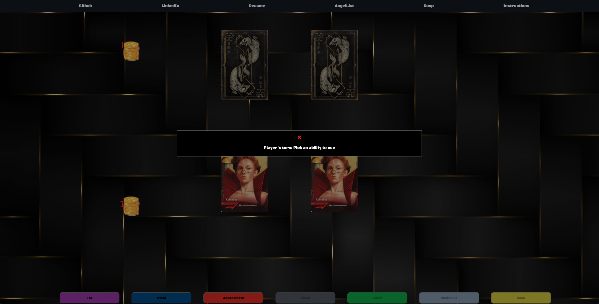
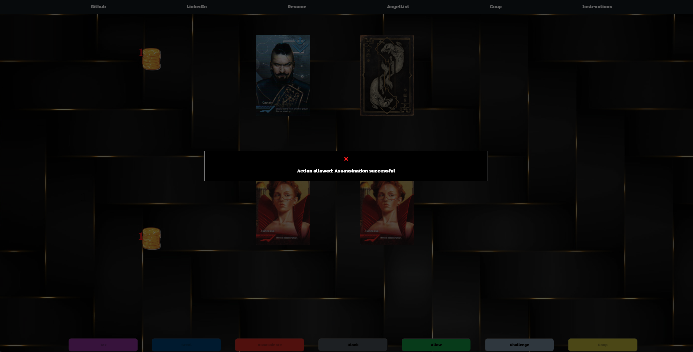

# [Coup](https://jay5375.github.io/Coup_javascript_project/)
# Background
Coup is a card based game where the goal is to entirely eliminate the influence of other players. There are 4 classes
each with unique abilities that can influence the player's coin pile or other players. Each player starts with 2 cards and 2 coins. Once a player has reached 10 coins, they can 'coup' another player. This forces the effected player to reveal one card, effectively eliminating that card from play. Each turn, players are able to use the ability of any class, however, opposing players can call a bluff on that action. In the event a bluff is called, if the player who used the ability does not have the corresponding card in their hand, that player then reveals one card. In turn, if the player does have the card in their hand, the person who called the bluff must reveal one of their cards. The last one standing wins.

# Functionality & MVPs
In Coup, users will be able to:
- Use card abilities in order to gain an advantage 
- Call bluffs on opponents actions 
- Check their coin pile to see how far they are from their intended action 
- See revealed opponents cards to make more informed decisions 

In addition, this project will include:
- A change or addition of a class in order to introduce a new dynamic 
- Animations for actions such as card abilities or drawing from deck 

# Technologies 
- canvas for animations 

# Implementation Timeline
- Friday & Weekend: Setup deck and card logic including classes and abilities
- Monday: Setup player and computer logic 
- Tuesday: Add animations to canvas to display the board and cards
- Wednesday: Touch up on animations and double check logic 
- Thursday: Add more complex logic to computer player

# Wireframe
